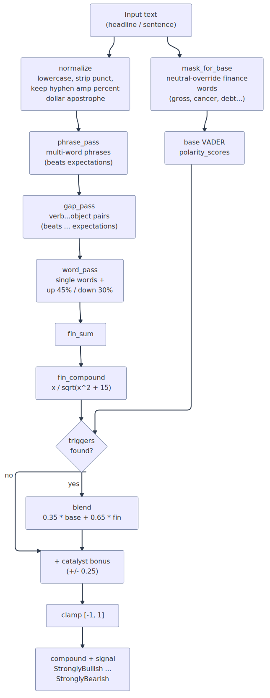
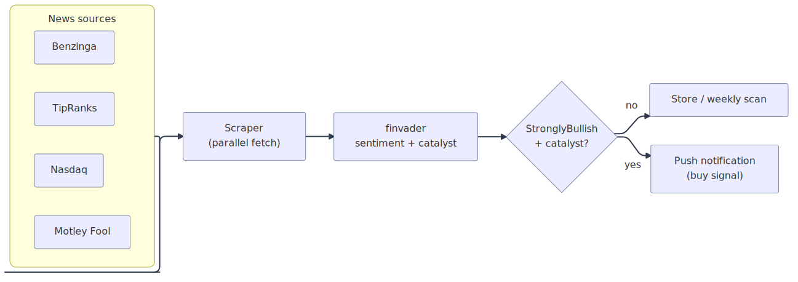

# finvader

**Finance-aware sentiment analysis for Rust.** VADER, extended with a financial
lexicon, phrase rules, and catalyst detection — tuned for news headlines and
market text instead of tweets.

[](https://crates.io/crates/finvader)
[](https://docs.rs/finvader)
[](./LICENSE)

Generic [VADER](https://github.com/cjhutto/vaderSentiment) was calibrated for
social media. On financial text it misfires in two directions:

- **Misses finance sentiment** — "beats expectations", "cuts guidance", "going
  concern" all score near zero.
- **Misfires on finance-neutral words** — "gross margin", "cancer drug", "debt
  refinancing" score negative because of everyday-English valences.

`finvader` fixes both, and adds detection for **catalysts** — single events
(FDA approval, buyout offer, index inclusion, bankruptcy) that permanently
re-rate a stock and deserve to be surfaced on their own.

## Accuracy

On a hand-labeled set of 60 financial headlines (`data/headlines.tsv`):

| Analyzer            | Correct signal | Accuracy  |
| ------------------- | -------------- | --------- |
| generic VADER       | 31 / 60        | 51.7%     |
| **finvader**        | **60 / 60**    | **100%**  |

## Quick start

```toml
[dependencies]
finvader = "0.1"
```

```rust
use finvader::{FinVader, Signal};

let fv = FinVader::new();
let s = fv.analyze("Acme beats Q3 expectations and raises full-year guidance");

assert!(s.compound > 0.5);
assert_eq!(s.signal, Signal::StronglyBullish);

// Which terms drove the score:
for t in &s.triggers {
    println!("{:<20} {:+.3}", t.term, t.valence);
}
```

Construct one `FinVader` and reuse it across calls — it loads the lexicons once
and is `Send + Sync`.

## How it works

Each input runs two parallel passes — a masked base-VADER pass and a financial
layer (phrases, gap-phrases, single words) — then the two are blended, nudged by
any catalyst, and clamped:

<p align="center">
  
</p>

- **normalize** — lowercase, strip punctuation, keep characters that matter in
  market text (`-`, `%`, `$`, `'`).
- **mask_for_base** — replace finance-neutral words (`gross`, `cancer`, `debt`,
  `crude`, `vice`, `share`/`shares`, …) with a neutral placeholder *before* the
  base VADER pass, so their everyday valences never pollute the score.
- **phrase / gap / word passes** — match multi-word phrases (`beats
  expectations`), gap-tolerant verb+object pairs (`beats … expectations`, up to
  two tokens apart), and single words. Matches are consumed so nothing is
  double-counted. `up 45%` / `down 30%` become magnitude-scaled directional
  moves.
- **negation & boosters** — `failed to beat expectations` flips; `sharply
  missed` amplifies; `slightly missed` softens; `beat by 40%` amplifies on
  magnitude.
- **blend** — when financial terms are present the score is
  `0.35 * base + 0.65 * financial`; otherwise the base VADER score passes
  through untouched.
- **catalyst bonus** — a detected event shifts the compound by ±0.25.

### Signals

`compound` is mapped to a discrete `Signal`:

| compound            | Signal            |
| ------------------- | ----------------- |
| `>= 0.5`            | `StronglyBullish` |
| `>= 0.15`           | `Bullish`         |
| `-0.15 .. 0.15`     | `Neutral`         |
| `<= -0.15`          | `Bearish`         |
| `<= -0.5`           | `StronglyBearish` |

### Catalyst detection

Beyond the smooth sentiment score, `finvader` flags episodic-pivot events and
returns them as an `Option<Catalyst>`:

- **Bullish** — FDA approval / clearance, breakthrough therapy, met primary
  endpoint, buyout / takeover / merger, S&P 500 inclusion, contract awards,
  record quarter, beat-and-raise.
- **Bearish** — FDA rejection, missed / failed endpoint, chapter 11 / 7, going
  concern, SEC charges, accounting fraud, auditor resignation.

## Where it fits

`finvader` is the scoring core of a news-driven momentum alert pipeline:

<p align="center">
  
</p>

## Performance

Single-threaded, release build, `cargo run --release --example bench`
(Apple Silicon):

| Analyzer          | per headline | throughput          |
| ----------------- | ------------ | ------------------- |
| generic VADER     | 1.8 µs       | ~570,000 / sec      |
| **finvader**      | 22.3 µs      | ~45,000 / sec       |

finvader does more work per call (masking + three match passes + catalyst
detection), and still clears tens of thousands of headlines per second per core.

## Lexicon

Single-word and phrase valences are calibrated for market news, informed by the
[Loughran-McDonald](https://sraf.nd.edu/loughranmcdonald-master-dictionary/)
financial sentiment research. Valences are on VADER's `-4.0 ..= 4.0` scale.

## Examples

```sh
cargo run --example demo     # side-by-side finvader vs generic VADER
cargo run --release --example bench   # throughput benchmark
```

## License

MIT
